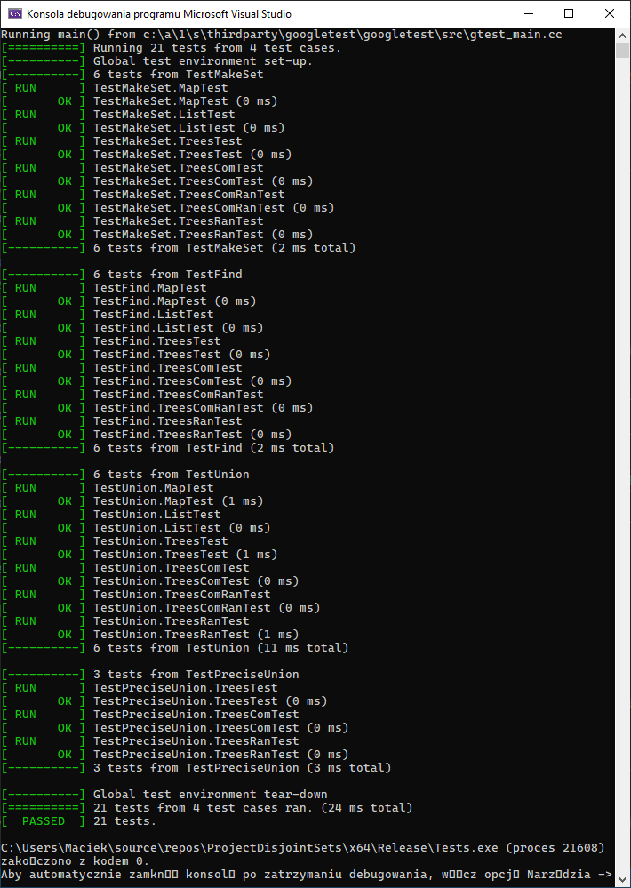

## DisjointSets
Projekt grupowy implementujący z użyciem C++20 algorytmy zbiorów rozłącznych. Repo zawiera:
* 6 implementacji zbiorów rozłącznych
* Testy jednostkowe dla każdego z nich
* Dużo benchmarków, pokazujących zalety i wady różnych rozwiązań

## Mapa folderów
* Benchmarks - Projekt zawierający implementacje benchmarków
  * bench_main.cpp - Punkt wejściowy Benchmarków i ich wywoływanie
  * BenchmarkBase.h - Implementacja narzędzi do benchmarkowania
* BenchOutput - Wyniki benchmarków
  * Bench i7 7700k - Wyniki na procesorze i7 7700k
    * Foldery benchmarków
      * NAZWA_BENCHMARKU 
         * `*.csv` 
         * `quick_lookup.py` - Skrypt agregujący dane w folderze (pliki CSV)
         * `Figure_1.png` - Prosta wizualizacja benchmarka
* ProjectDisjointSets - Projekt zawierający implementacje DisjointSetów
  * `main.cpp` - Punkt wejściowy do projektu (Proste przedstawienie działania Implementacji)
  * `DisjointSetBase.h` - Plik zawierający definicje interfejsów użytch w projektach
  * Implementations - Implementacje zbiorów rozłącznych
    * `DisjointSetList.h` - Implementacja listowa
    * `DisjointSetTrees.h` - Implementacja metodą Lasu
    * `DisjointSetMap.h` - Naiwna implementacja z użyciem mapy
    * `DisjointSetTreesCom.h` - Implementacja Lasem z kompresją ścieżki
    * `DisjointSetTreesComRan.h`  - Implementacja Lasem z rangą i kompresją ścieżki 
    * `DisjointSetTreesRan.h` - Implementacja Lasem z rangą 
* Tests - Projekt zawierający testy
  * `test_main.cpp` - Main testów i ich implementacja
  * `TestOutput.png` - Wynik działania projektu
  
## Overview

## Wyniki testów

